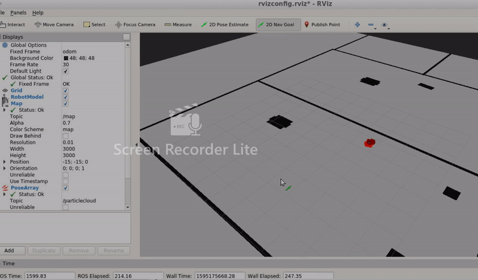

# RoboND-Where Am I

This is the project library of third project of udacity robotics software nano degree. The project is developed to make a simulation of world and robot. Simulated robot moves to intended location by doing self amcl localization algorithm

## Implementation

This workspace is fully developed with gazebo workspace. Output is given below

## launch commands

For world launch

		cd RoboND-WhereAmI-
		source devel/setup.bash
		roslaunch my_robot world.launch
        
For amcl algorithm launch

		cd RoboND-WhereAmI-
		source devel/setup.bash
		roslaunch my_robot amcl.launch
        
## rvis visualization

use rviz configuration file 'rvizconfig.rviz' 