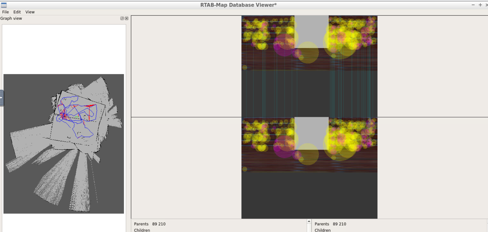

# RoboND-Where Am I

This is the project library of fourth project of udacity robotics software nano degree. The project is developed to make a simulation of world and robot. Simulated robot have to be navigated manually to develop customized map

## Implementation

This workspace is fully developed with gazebo workspace. Output is given below

## launch commands

For world launch

		cd RoboND-WhereAmI-
		source devel/setup.bash
		roslaunch my_robot world.launch
        
For mapping algorithm launch (start with new database file, default location: /root/.ros/rtabmap.db )

		cd RoboND-WhereAmI-
		source devel/setup.bash
		roslaunch my_robot mapping.launch
        
For localization launch (to map with existing database)

		cd RoboND-WhereAmI-
		source devel/setup.bash
		roslaunch my_robot localization.launch
        
## navigation through teleop

rosrun teleop_twist_keyboard teleop_twist_keyboard.py

## rtab visualization

rtabmap-databaseViewer <path to database file>
  
## database split and join
  
split a database (to 40 mb)

		split -b 40M rtabmap.db rtab.
        
combine files

		cat rtab.?? > rtabmap.db