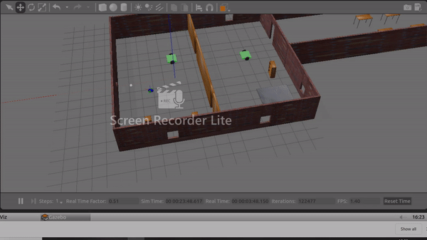

# RoboND-goChaseIt

This is the project library of second project of udacity robotics software nano degree. The project is developed to make a simulation of world and robot. Simulated robot chases the ball whenever the ball is located in front of camera. 

## Implementation

This workspace is fully developed with gazebo workspace. Output is given below

## launch commands

For world launch

		cd /home/workspace/catkin_ws/
		source devel/setup.bash
		roslaunch my_robot world.launch
        
For chasing algorithm launch

		cd /home/workspace/catkin_ws/
		source devel/setup.bash
		roslaunch ball_chaser ball_chaser.launch
        
## rvis visualization

use rviz configuration file 'rvizconfig.rviz' 